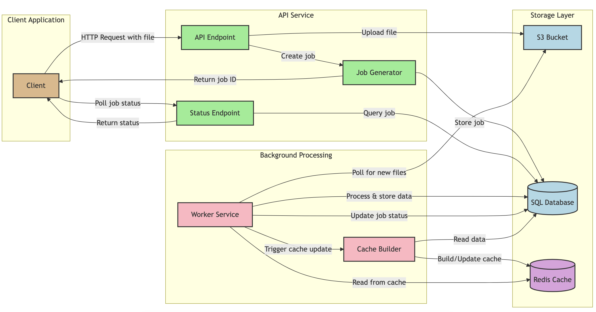

# Ensek API

Tech test for Ensek

Loosley based on [Dagable.Api](https://github.com/dagable/Dagable.Api) 

## Tech

### Tools
- Swagger - for API documentation
- Moq - for mocking in unit tests
- CSvHelper - For parsing CSV
- EntityFramework 

### Architecture

#### Ensek.Api

- Validates incoming request objects and standardises return object.
- Masks any exceptions thrown anywhere within the application
	+ See `Ensek.Api/Pipleine`
- Controller end points 
- Holds startup services and middleware registration
	+ Runs migrations on startup.

#### Ensek.Api.Services

- Business Logic
- Interface between data access and API presentation layers
- Deduplication and Account validation is done here.
	+ This should be a cache or done withint he database. See below.

#### Ensek.DataAccess

- Data Access Layer
- Interacts with database 
- Used for changes within the database through code first EF

#### Cdr.ErrorManagement

- Error/Exception handling 
- This ideally would be a standardised organisation package install via `Nuget` 
	+ Any specific errors would be loaded and injected
- This is really just a place holder, error logging etc would run through here. [See example](https://github.com/jwmxyz/DWS_CDR_API/blob/main/src/Cdr.ErrorManagementLibrary/CdrErrorManager.cs)
	
## Getting Started

### Prerequisites

- .Net 8
- Entity framework
	+ `dotnet tool install --global dotnet-ef`

### Setup 

- Clone this Repo
- Set the connection string.
- Run `dotnet run`
- Swagger documentation will be `http://localhost:<port>/swagger/index.html`

### Improvements/Enhancements
- Add a useable UI (Sorry)
- Proper CI/CD
- Docker support
- Improved test cases and test coverage (unit/E2E/integration tests)
- Improve (or even add) Logging integration
- Improved Swagger documentation/examples inline with OAS
- API Versioning
- This API should not write bulk files to the database AND function as an API.

  

